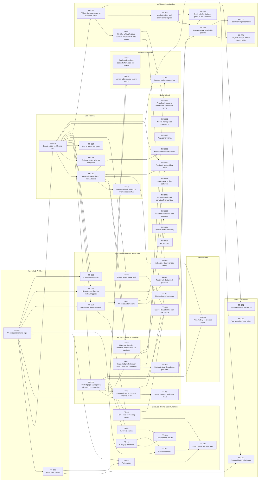

# DealShare Requirements Backlog

> **Generated** from `requirements.yaml` by `tools/build_backlog.py`. Edit the YAML, not this file.

**53 requirements** (43 functional, 10 nonfunctional) · must: 27 · should: 21 · could: 5 · blocked: 7 · deferred: 1 · proposed: 45

Source references (T1–T6) point to client turns in [`docs/elicitation-transcript.md`](../docs/elicitation-transcript.md). Open questions (OQ-xx) are in [`docs/open-questions.md`](../docs/open-questions.md).

## Summary

| ID | Title | Type | Level | Priority | Status | Risk | Depends on | Blocked by |
|---|---|---|---|---|---|---|---|---|
| [FR-001](#fr-001) | User registration and sign-in | func. | high | must | proposed | low | — | — |
| [FR-010](#fr-010) | Create a deal post from a URL | func. | high | must | proposed | medium | FR-001 | — |
| [FR-011](#fr-011) | Automatic extraction of listing details | func. | high | must | proposed | high | FR-010 | OQ-04, OQ-07 |
| [FR-012](#fr-012) | Manual fallback fields only when extraction fails | func. | low ↳ FR-011 | must | proposed | low | FR-011 | — |
| [FR-020](#fr-020) | Product page aggregating all deals for one product | func. | high | must | proposed | medium | FR-010 | — |
| [FR-021](#fr-021) | Suggested product match with one-click confirmation | func. | high | must | proposed | high | FR-011, FR-020 | — |
| [FR-022](#fr-022) | Match products by standard identifiers where available | func. | low ↳ FR-021 | must | proposed | medium | FR-011 | — |
| [FR-023](#fr-023) | Duplicate deal detection at post time | func. | high | must | proposed | medium | FR-021 | — |
| [FR-030](#fr-030) | Variant tabs under a parent product | func. | high | must | proposed | high | FR-020 | OQ-03 |
| [FR-032](#fr-032) | Deal condition kept separate from best-price ranking | func. | high | must | proposed | low | FR-020 | — |
| [FR-040](#fr-040) | Home feed of trending deals | func. | high | must | proposed | medium | FR-020, FR-050 | — |
| [FR-041](#fr-041) | Category browsing | func. | high | must | proposed | low | FR-020 | — |
| [FR-042](#fr-042) | Keyword search | func. | high | must | proposed | low | FR-020 | — |
| [FR-050](#fr-050) | Upvote and downvote deals | func. | high | must | proposed | low | FR-001, FR-010 | — |
| [FR-051](#fr-051) | User reputation score | func. | high | must | proposed | medium | FR-050 | — |
| [FR-053](#fr-053) | Report a deal as expired | func. | high | must | proposed | low | FR-010 | OQ-10 |
| [FR-055](#fr-055) | Expired deals hidden from live listings | func. | high | must | proposed | low | FR-053, FR-020, FR-040 | — |
| [FR-056](#fr-056) | Report spam, fake, or misleading posts | func. | high | must | proposed | low | FR-010, FR-001 | — |
| [FR-060](#fr-060) | Affiliate link conversion for outbound clicks | func. | high | must | proposed | medium | FR-010 | OQ-04 |
| [FR-061](#fr-061) | Retailer affiliate/product APIs as the preferred data source | func. | low ↳ FR-011 | must | proposed | high | FR-060 | OQ-04, OQ-07 |
| [FR-070](#fr-070) | Poster affiliation disclosure | func. | high | must | proposed | low | FR-010, FR-002 | — |
| [FR-071](#fr-071) | Site-wide affiliate disclosure | func. | high | must | proposed | low | FR-060 | — |
| [FR-002](#fr-002) | Public user profile | func. | high | should | proposed | low | FR-001 | — |
| [FR-013](#fr-013) | Optional poster write-up and photos | func. | high | should | proposed | low | FR-010 | — |
| [FR-014](#fr-014) | Edit or delete own post | func. | high | should | proposed | low | FR-010 | — |
| [FR-024](#fr-024) | Flag duplicate products or misfiled deals | func. | high | should | proposed | medium | FR-001, FR-020 | — |
| [FR-025](#fr-025) | Merge products and move deals | func. | high | should | blocked | high | FR-024 | OQ-01 |
| [FR-031](#fr-031) | Suggest variant at post time | func. | low ↳ FR-030 | should | blocked | high | FR-030, FR-021 | OQ-03 |
| [FR-043](#fr-043) | Filter and sort results | func. | low ↳ FR-042 | should | proposed | low | FR-042, FR-041 | — |
| [FR-044](#fr-044) | Follow users | func. | high | should | proposed | low | FR-001, FR-002 | — |
| [FR-045](#fr-045) | Follow categories | func. | high | should | proposed | low | FR-001, FR-041 | — |
| [FR-052](#fr-052) | Trust levels that unlock privileges | func. | high | should | proposed | medium | FR-051 | OQ-01 |
| [FR-054](#fr-054) | Automated deal liveness check | func. | low ↳ FR-055 | should | proposed | high | FR-011, FR-061 | — |
| [FR-057](#fr-057) | Moderation review queue | func. | high | should | blocked | medium | FR-056, FR-024 | OQ-01 |
| [FR-062](#fr-062) | Attribute clicks and conversions to posts | func. | high | should | proposed | medium | FR-060 | — |
| [FR-063](#fr-063) | Revenue share for eligible posters | func. | high | should | blocked | high | FR-062, FR-052 | OQ-02, OQ-05 |
| [FR-064](#fr-064) | Payouts through a third-party provider | func. | low ↳ FR-063 | should | blocked | medium | FR-063 | OQ-08 |
| [FR-066](#fr-066) | Credit rule for duplicate posts of the same deal | func. | high | should | blocked | high | FR-023, FR-062 | OQ-06 |
| [FR-046](#fr-046) | Personalized following feed | func. | high | could | proposed | low | FR-044, FR-045, FR-040 | — |
| [FR-058](#fr-058) | Comments on deals | func. | high | could | proposed | low | FR-010, FR-001 | — |
| [FR-065](#fr-065) | Poster earnings dashboard | func. | high | could | proposed | low | FR-063 | — |
| [FR-072](#fr-072) | Flag unverified "was" prices | func. | high | could | proposed | medium | FR-080 | — |
| [FR-080](#fr-080) | Price history on product pages | func. | high | could | deferred | medium | FR-020, FR-054 | — |
| [NFR-001](#nfr-001) | Posting is fast and low-effort | nonf. | high | must | proposed | medium | FR-010, FR-011, FR-021 | — |
| [NFR-002](#nfr-002) | Mobile-friendly web experience | nonf. | high | must | proposed | low | — | — |
| [NFR-005](#nfr-005) | Price freshness and compliance with retailer terms | nonf. | high | must | proposed | medium | FR-061 | OQ-04 |
| [NFR-006](#nfr-006) | Legal review of data collection | nonf. | high | must | blocked | high | — | OQ-07 |
| [NFR-007](#nfr-007) | Minimal handling of sensitive financial data | nonf. | high | must | proposed | low | — | — |
| [NFR-003](#nfr-003) | Page performance | nonf. | high | should | proposed | low | — | OQ-09 |
| [NFR-004](#nfr-004) | Product match accuracy | nonf. | high | should | proposed | high | FR-021 | — |
| [NFR-008](#nfr-008) | Pluggable store integrations | nonf. | high | should | proposed | low | FR-011 | — |
| [NFR-009](#nfr-009) | Abuse resistance for new accounts | nonf. | high | should | proposed | medium | FR-051 | — |
| [NFR-010](#nfr-010) | Accessibility | nonf. | high | should | proposed | low | — | — |

## Dependency graph

An arrow A → B means B depends on A.

## Highest-risk requirements

These have high expected volatility or implementation risk. Track their change frequency and prioritize testing them.

- **FR-011** Automatic extraction of listing details
- **FR-021** Suggested product match with one-click confirmation
- **FR-025** Merge products and move deals
- **FR-030** Variant tabs under a parent product
- **FR-031** Suggest variant at post time
- **FR-054** Automated deal liveness check
- **FR-061** Retailer affiliate/product APIs as the preferred data source
- **FR-063** Revenue share for eligible posters
- **FR-066** Credit rule for duplicate posts of the same deal
- **NFR-004** Product match accuracy
- **NFR-006** Legal review of data collection

## Details by epic

### Accounts & Profiles

#### FR-001
**User registration and sign-in**

*As a shopper, I want to create an account so that I can post deals, vote, and follow people.*

- **Type / category:** functional / accounts
- **Level:** high
- **Priority:** must · **Status:** proposed · **Risk:** low
- **Source:** inferred (T2, T5 – following, reputation and payouts all require accounts)
- **Depends on:** none
- **Required by:** FR-002, FR-010, FR-024, FR-044, FR-045, FR-050, FR-056, FR-058
- **Acceptance criteria:**
  - A visitor can register with email + password or a third-party sign-in provider.
  - Anonymous visitors can browse and search but cannot post, vote, or flag.

#### FR-002
**Public user profile**

*As a shopper, I want to see a poster's history and reputation so that I can decide whether to trust them.*

- **Type / category:** functional / accounts
- **Level:** high
- **Priority:** should · **Status:** proposed · **Risk:** low
- **Source:** T2 ("if someone always finds great camping gear deals")
- **Depends on:** FR-001
- **Required by:** FR-044, FR-070
- **Acceptance criteria:**
  - Profile shows the user's posts, reputation score, trust level, and any declared affiliations.

### Deal Posting

#### FR-010
**Create a deal post from a URL**

*As a poster, I want to share a deal by pasting a product link so that sharing takes almost no effort.*

- **Type / category:** functional / posting
- **Level:** high
- **Priority:** must · **Status:** proposed · **Risk:** medium
- **Source:** T2 ("someone finds a deal, pastes the link, puts in the price and the store")
- **Depends on:** FR-001
- **Required by:** FR-011, FR-013, FR-014, FR-020, FR-050, FR-053, FR-056, FR-058, FR-060, FR-070, NFR-001
- **Acceptance criteria:**
  - Input is a product URL. Output is a draft post pre-filled with whatever the system could extract.
  - The draft is published only after the user confirms it.

#### FR-011
**Automatic extraction of listing details**

*As a poster, I want the site to fill in the product name, image, store and price automatically so that I don't have to type them.*

- **Type / category:** functional / posting
- **Level:** high
- **Priority:** must · **Status:** proposed · **Risk:** high
- **Source:** T3, T4
- **Depends on:** FR-010
- **Required by:** FR-012, FR-021, FR-022, FR-054, NFR-001, NFR-008
- **Blocked by:** OQ-04, OQ-07
- **Acceptance criteria:**
  - Given a URL, the system returns title, image, store, current price and any product identifiers it can find, each with a confidence value.
  - Extraction never blocks posting. On failure, it falls back to FR-012.

#### FR-012
**Manual fallback fields only when extraction fails**

*As a poster on an unsupported store, I want to enter only the fields the system couldn't find.*

- **Type / category:** functional / posting
- **Level:** low (refines FR-011)
- **Priority:** must · **Status:** proposed · **Risk:** low
- **Source:** T3 ("ask the user for a name or a photo on some random boutique site")
- **Depends on:** FR-011
- **Required by:** none
- **Acceptance criteria:**
  - The form shows only fields whose extraction failed or fell below the confidence threshold.
  - Required manual fields are limited to product name, price, and store.

#### FR-013
**Optional poster write-up and photos**

*As an experienced owner, I want to add my own description and photos so that others benefit from my experience.*

- **Type / category:** functional / posting
- **Level:** high
- **Priority:** should · **Status:** proposed · **Risk:** low
- **Source:** T2, T5 ("I own this, here's what's good and bad about it")
- **Depends on:** FR-010
- **Required by:** none
- **Acceptance criteria:**
  - Posts accept an optional text description (max 2,000 chars) and up to 5 images.
  - These fields are never required to publish.

#### FR-014
**Edit or delete own post**

*As a poster, I want to correct or remove my post so that I can fix mistakes.*

- **Type / category:** functional / posting
- **Level:** high
- **Priority:** should · **Status:** proposed · **Risk:** low
- **Source:** inferred
- **Depends on:** FR-010
- **Required by:** none
- **Acceptance criteria:**
  - The author can edit the description, photos and price, and can delete the post. Edits are timestamped.

### Product Catalog & Matching

#### FR-020
**Product page aggregating all deals for one product**

*As a shopper, I want to see every deal for a product across stores on one page so that I never miss a better price.*

- **Type / category:** functional / catalog
- **Level:** high
- **Priority:** must · **Status:** proposed · **Risk:** medium
- **Source:** T2 ("you'd have a page for 'that monitor' ... with the best one at the top")
- **Depends on:** FR-010
- **Required by:** FR-021, FR-024, FR-030, FR-032, FR-040, FR-041, FR-042, FR-055, FR-080
- **Acceptance criteria:**
  - Each deal post belongs to exactly one product.
  - The product page lists active deals from all stores, sorted by lowest price within the selected condition (see FR-032).

#### FR-021
**Suggested product match with one-click confirmation**

*As a poster, I want the site to suggest which product my deal belongs to so that I can file it with one click.*

- **Type / category:** functional / catalog
- **Level:** high
- **Priority:** must · **Status:** proposed · **Risk:** high
- **Source:** T3 ("Looks like this is the LG 27GP850, is that right?")
- **Depends on:** FR-011, FR-020
- **Required by:** FR-023, FR-031, NFR-001, NFR-004
- **Acceptance criteria:**
  - After extraction, the system shows its best match plus up to 3 alternatives, and a "this is a new product" option.
  - Confirming a match requires one click. No model number or SKU entry is ever required.

#### FR-022
**Match products by standard identifiers where available**

*As the system, I want to match on GTIN/UPC, ASIN, or manufacturer part number before fuzzy title matching so that matches are reliable.*

- **Type / category:** functional / catalog
- **Level:** low (refines FR-021)
- **Priority:** must · **Status:** proposed · **Risk:** medium
- **Source:** inferred (T3, T4)
- **Depends on:** FR-011
- **Required by:** none
- **Acceptance criteria:**
  - If an extracted identifier equals one on an existing product, that product is the top suggestion.
  - Otherwise the system falls back to title/brand similarity matching.

#### FR-023
**Duplicate deal detection at post time**

*As a poster, I want to be told if this deal is already posted so that I upvote it instead of duplicating it.*

- **Type / category:** functional / catalog
- **Level:** high
- **Priority:** must · **Status:** proposed · **Risk:** medium
- **Source:** T2 ("five different people post the same deal ... exactly the cluttered coupon-site feel I hate")
- **Depends on:** FR-021
- **Required by:** FR-066
- **Acceptance criteria:**
  - If an active deal exists for the same product, store, condition and price (within 1%), the poster is shown it and offered "upvote existing".
  - Duplicate deals never appear as separate items in the home feed.

#### FR-024
**Flag duplicate products or misfiled deals**

*As a community member, I want to flag duplicate product pages or wrongly filed deals so that the catalog stays clean.*

- **Type / category:** functional / catalog
- **Level:** high
- **Priority:** should · **Status:** proposed · **Risk:** medium
- **Source:** T3 ("someone flags 'these two product pages are the same thing'")
- **Depends on:** FR-001, FR-020
- **Required by:** FR-025, FR-057
- **Acceptance criteria:**
  - Users can flag a product as duplicate of another product, or flag a deal as belonging to a different product or variant.
  - Flags go to the review queue (FR-057).

#### FR-025
**Merge products and move deals**

*As an authorized user, I want to merge duplicate product pages and move misfiled deals so that each product has one page.*

- **Type / category:** functional / catalog
- **Level:** high
- **Priority:** should · **Status:** blocked · **Risk:** high
- **Source:** T3, T6
- **Depends on:** FR-024
- **Required by:** none
- **Blocked by:** OQ-01
- **Acceptance criteria:**
  - Merging moves all deals and variants to the surviving product and redirects the old URL.
  - Every merge or move is logged and can be undone.

### Variants & Condition

#### FR-030
**Variant tabs under a parent product**

*As a shopper, I want deals for different colors, sizes, or configurations shown as separate tabs on one product page so that I compare like with like.*

- **Type / category:** functional / catalog
- **Level:** high
- **Priority:** must · **Status:** proposed · **Risk:** high
- **Source:** T3 ("same shoes in a different color ... 16 gigs instead of 32")
- **Depends on:** FR-020
- **Required by:** FR-031
- **Blocked by:** OQ-03
- **Acceptance criteria:**
  - A product may have zero or more variants, each defined by attribute/value pairs (e.g. color=black, ram=16GB).
  - Each variant tab has its own best-price ranking.

#### FR-031
**Suggest variant at post time**

*As a poster, I want the site to guess which variant my deal is so that I don't have to pick from a long list.*

- **Type / category:** functional / catalog
- **Level:** low (refines FR-030)
- **Priority:** should · **Status:** blocked · **Risk:** high
- **Source:** T3
- **Depends on:** FR-030, FR-021
- **Required by:** none
- **Blocked by:** OQ-03
- **Acceptance criteria:**
  - The system pre-selects a variant from the extracted data. The poster can change it or add a new variant.

#### FR-032
**Deal condition kept separate from best-price ranking**

*As a shopper, I want refurbished, open-box and used deals labeled and ranked separately so that I'm never misled about the best price.*

- **Type / category:** functional / catalog
- **Level:** high
- **Priority:** must · **Status:** proposed · **Risk:** low
- **Source:** T3 ("if a refurbished deal sits at the top ... people will feel tricked"), T6
- **Depends on:** FR-020
- **Required by:** none
- **Acceptance criteria:**
  - Every deal has a condition of new, refurbished, open-box, or used. The default is new.
  - The best-price slot compares only deals with the same condition. Non-new deals display a visible condition badge.

### Discovery (Home, Search, Follow)

#### FR-040
**Home feed of trending deals**

*As a shopper, I want a home page of the hottest current deals so that I can discover deals without searching.*

- **Type / category:** functional / discovery
- **Level:** high
- **Priority:** must · **Status:** proposed · **Risk:** medium
- **Source:** T2 ("main feed of what's hot right now ... the YouTube home page idea")
- **Depends on:** FR-020, FR-050
- **Required by:** FR-046, FR-055
- **Acceptance criteria:**
  - The feed ranks active deals by a score combining votes and recency.
  - Expired deals and duplicates are excluded.

#### FR-041
**Category browsing**

*As a shopper, I want to browse deals by category so that I can focus on what I'm shopping for.*

- **Type / category:** functional / discovery
- **Level:** high
- **Priority:** must · **Status:** proposed · **Risk:** low
- **Source:** T2 ("categories like electronics, home, clothing")
- **Depends on:** FR-020
- **Required by:** FR-043, FR-045
- **Acceptance criteria:**
  - Every product belongs to at least one category in a hierarchical category list.

#### FR-042
**Keyword search**

*As a shopper, I want to search for a product by name so that I can check for deals before I buy.*

- **Type / category:** functional / discovery
- **Level:** high
- **Priority:** must · **Status:** proposed · **Risk:** low
- **Source:** T2
- **Depends on:** FR-020
- **Required by:** FR-043
- **Acceptance criteria:**
  - Input is a keyword query. Output is matching products, with their best active deal shown on each result.

#### FR-043
**Filter and sort results**

*As a shopper, I want to filter by category, store, price range, discount and condition so that I can narrow results.*

- **Type / category:** functional / discovery
- **Level:** low (refines FR-042)
- **Priority:** should · **Status:** proposed · **Risk:** low
- **Source:** inferred (developer summary, end of meeting)
- **Depends on:** FR-042, FR-041
- **Required by:** none
- **Acceptance criteria:**
  - Filters can be combined. Sort options are price, discount %, popularity, and newest.

#### FR-044
**Follow users**

*As a shopper, I want to follow posters I trust so that their deals reach me.*

- **Type / category:** functional / discovery
- **Level:** high
- **Priority:** should · **Status:** proposed · **Risk:** low
- **Source:** T2 ("I want to see their stuff")
- **Depends on:** FR-001, FR-002
- **Required by:** FR-046
- **Acceptance criteria:**
  - A user can follow or unfollow another user from that user's profile.

#### FR-045
**Follow categories**

*As a shopper, I want to follow categories so that I see deals in areas I care about.*

- **Type / category:** functional / discovery
- **Level:** high
- **Priority:** should · **Status:** proposed · **Risk:** low
- **Source:** T2
- **Depends on:** FR-001, FR-041
- **Required by:** FR-046
- **Acceptance criteria:**
  - A user can follow or unfollow any category.

#### FR-046
**Personalized following feed**

*As a shopper, I want a feed of deals from people and categories I follow.*

- **Type / category:** functional / discovery
- **Level:** high
- **Priority:** could · **Status:** proposed · **Risk:** low
- **Source:** T2
- **Depends on:** FR-044, FR-045, FR-040
- **Required by:** none
- **Acceptance criteria:**
  - The feed shows active deals from followed users and categories, newest first.

### Community Quality & Moderation

#### FR-050
**Upvote and downvote deals**

*As a shopper, I want to vote on deals so that good deals rise and bad ones sink.*

- **Type / category:** functional / community
- **Level:** high
- **Priority:** must · **Status:** proposed · **Risk:** low
- **Source:** T1 ("good deals rise, dead or junk deals sink"), T6
- **Depends on:** FR-001, FR-010
- **Required by:** FR-040, FR-051
- **Acceptance criteria:**
  - Each user can cast at most one vote per deal and can change it.

#### FR-051
**User reputation score**

*As the platform, I want each user to have a reputation based on the quality of their contributions so that trust can be earned.*

- **Type / category:** functional / community
- **Level:** high
- **Priority:** must · **Status:** proposed · **Risk:** medium
- **Source:** T5 ("new users earn reputation ... from upvotes and accurate posts")
- **Depends on:** FR-050
- **Required by:** FR-052, NFR-009
- **Acceptance criteria:**
  - Reputation rises from upvotes on the user's posts and falls from confirmed spam, fake, or duplicate flags.

#### FR-052
**Trust levels that unlock privileges**

*As the platform, I want reputation thresholds that unlock privileges such as revenue share and moderation so that bad actors can't exploit them.*

- **Type / category:** functional / community
- **Level:** high
- **Priority:** should · **Status:** proposed · **Risk:** medium
- **Source:** T5 ("once someone has a track record, they unlock the revenue share")
- **Depends on:** FR-051
- **Required by:** FR-063
- **Blocked by:** OQ-01
- **Acceptance criteria:**
  - Trust levels are configurable thresholds on reputation.
  - Dropping below a threshold revokes the privileges that level grants.

#### FR-053
**Report a deal as expired**

*As a shopper, I want to mark a deal as dead so that others don't waste time on it.*

- **Type / category:** functional / community
- **Level:** high
- **Priority:** must · **Status:** proposed · **Risk:** low
- **Source:** T4, T6 ("users clicking 'this deal is dead'")
- **Depends on:** FR-010
- **Required by:** FR-055
- **Blocked by:** OQ-10
- **Acceptance criteria:**
  - Once the expiry-report threshold (OQ-10) is reached, the deal's status changes to expired.

#### FR-054
**Automated deal liveness check**

*As the platform, I want to re-check prices on supported stores periodically so that expired deals are caught automatically.*

- **Type / category:** functional / community
- **Level:** low (refines FR-055)
- **Priority:** should · **Status:** proposed · **Risk:** high
- **Source:** T4 ("the deal might be dead tomorrow"), T6
- **Depends on:** FR-011, FR-061
- **Required by:** FR-080
- **Acceptance criteria:**
  - Deals from API-supported stores are re-checked at least every 24 hours.
  - A price increase above the posted price, or an out-of-stock result, marks the deal expired.

#### FR-055
**Expired deals hidden from live listings**

*As a shopper, I want expired deals clearly marked and removed from feeds so that everything I see as live really is.*

- **Type / category:** functional / community
- **Level:** high
- **Priority:** must · **Status:** proposed · **Risk:** low
- **Source:** T1 ("a deal that died last Tuesday"), T6 ("this was my number one complaint")
- **Depends on:** FR-053, FR-020, FR-040
- **Required by:** none
- **Acceptance criteria:**
  - Expired deals are excluded from the home feed and from best-price slots.
  - They stay visible on the product page in a collapsed "past deals" section with an Expired label.

#### FR-056
**Report spam, fake, or misleading posts**

*As a shopper, I want to report fake or spammy posts so that the site stays trustworthy.*

- **Type / category:** functional / community
- **Level:** high
- **Priority:** must · **Status:** proposed · **Risk:** low
- **Source:** T5 ("fake or inflated deals ... spam every product")
- **Depends on:** FR-010, FR-001
- **Required by:** FR-057
- **Acceptance criteria:**
  - The report reasons are spam, fake/inflated discount, undisclosed affiliation, and other.

#### FR-057
**Moderation review queue**

*As a moderator, I want one queue of flags and reports so that I can act on them quickly.*

- **Type / category:** functional / community
- **Level:** high
- **Priority:** should · **Status:** blocked · **Risk:** medium
- **Source:** T3, T5
- **Depends on:** FR-056, FR-024
- **Required by:** none
- **Blocked by:** OQ-01
- **Acceptance criteria:**
  - Moderators can dismiss, remove, merge, move, or penalize. Every action is logged.

#### FR-058
**Comments on deals**

*As a shopper, I want to comment on a deal so that I can ask questions or share experience.*

- **Type / category:** functional / community
- **Level:** high
- **Priority:** could · **Status:** proposed · **Risk:** low
- **Source:** inferred (T1 "feel like a community, not a coupon dump")
- **Depends on:** FR-010, FR-001
- **Required by:** none
- **Acceptance criteria:**
  - Signed-in users can post threaded comments on any deal.

### Affiliate & Monetization

#### FR-060
**Affiliate link conversion for outbound clicks**

*As the business, I want outbound links to participating stores to carry our affiliate tag so that purchases earn commission.*

- **Type / category:** functional / monetization
- **Level:** high
- **Priority:** must · **Status:** proposed · **Risk:** medium
- **Source:** T4 ("the way this site makes money is affiliate links")
- **Depends on:** FR-010
- **Required by:** FR-061, FR-062, FR-071
- **Blocked by:** OQ-04
- **Acceptance criteria:**
  - Links to stores in an active affiliate program are rewritten to affiliate links at click time.
  - Links to non-participating stores pass through unchanged.

#### FR-061
**Retailer affiliate/product APIs as the preferred data source**

*As the platform, I want to get product data from official retailer APIs where available so that we're a partner to stores, not a scraper.*

- **Type / category:** functional / monetization
- **Level:** low (refines FR-011)
- **Priority:** must · **Status:** proposed · **Risk:** high
- **Source:** T4 ("official access to product info ... cleaner route than scraping"), developer summary
- **Depends on:** FR-060
- **Required by:** FR-054, NFR-005
- **Blocked by:** OQ-04, OQ-07
- **Acceptance criteria:**
  - For stores with an API integration, extraction uses the API.
  - Page metadata parsing is used only where permitted, and only when no API exists.

#### FR-062
**Attribute clicks and conversions to posts**

*As the business, I want each outbound click and resulting commission tied to the post and poster so that revenue can be shared.*

- **Type / category:** functional / monetization
- **Level:** high
- **Priority:** should · **Status:** proposed · **Risk:** medium
- **Source:** T5
- **Depends on:** FR-060
- **Required by:** FR-063, FR-066
- **Acceptance criteria:**
  - Each outbound click records the deal ID, poster ID, and timestamp.
  - Conversion reports from affiliate networks are matched back to these click records.

#### FR-063
**Revenue share for eligible posters**

*As a trusted poster, I want a share of the commission my deals earn so that I'm rewarded for quality contributions.*

- **Type / category:** functional / monetization
- **Level:** high
- **Priority:** should · **Status:** blocked · **Risk:** high
- **Source:** T5 ("the YouTube effect")
- **Depends on:** FR-062, FR-052
- **Required by:** FR-064, FR-065
- **Blocked by:** OQ-02, OQ-05
- **Acceptance criteria:**
  - Only users at or above the monetization trust level accrue earnings.
  - The share percentage is configurable (OQ-02).

#### FR-064
**Payouts through a third-party provider**

*As a trusted poster, I want to get paid through a trusted payment service so that I don't share bank details with the site.*

- **Type / category:** functional / monetization
- **Level:** low (refines FR-063)
- **Priority:** should · **Status:** blocked · **Risk:** medium
- **Source:** T5 ("I really don't want us holding people's bank info")
- **Depends on:** FR-063
- **Required by:** none
- **Blocked by:** OQ-08
- **Acceptance criteria:**
  - Payout onboarding, tax forms, and bank details are handled by the provider.
  - The platform stores only the provider's account reference.

#### FR-065
**Poster earnings dashboard**

*As a trusted poster, I want to see clicks, conversions, and earnings per post so that I know what's working.*

- **Type / category:** functional / monetization
- **Level:** high
- **Priority:** could · **Status:** proposed · **Risk:** low
- **Source:** inferred (T5)
- **Depends on:** FR-063
- **Required by:** none
- **Acceptance criteria:**
  - The dashboard shows clicks, conversions, pending earnings, and paid earnings per post and in total.

#### FR-066
**Credit rule for duplicate posts of the same deal**

*As a poster, I want a clear, published rule for who earns credit when the same deal is shared by several people so that it's fair.*

- **Type / category:** functional / monetization
- **Level:** high
- **Priority:** should · **Status:** blocked · **Risk:** high
- **Source:** T5 ("who gets credit? ... that will cause fights"), T6
- **Depends on:** FR-023, FR-062
- **Required by:** none
- **Blocked by:** OQ-06
- **Acceptance criteria:**
  - The rule is published in the help center and applied automatically at attribution time.

### Trust & Disclosure

#### FR-070
**Poster affiliation disclosure**

*As a shopper, I want to see when a poster is affiliated with the brand or store so that I can judge their post.*

- **Type / category:** functional / trust
- **Level:** high
- **Priority:** must · **Status:** proposed · **Risk:** low
- **Source:** T5, T6 ("people affiliated with the brand ... have to say so")
- **Depends on:** FR-010, FR-002
- **Required by:** none
- **Acceptance criteria:**
  - The post form asks "Are you affiliated with this brand or store?".
  - A "yes" displays an Affiliated badge on the post and is recorded on the poster's profile.

#### FR-071
**Site-wide affiliate disclosure**

*As a shopper, I want to know the site earns commission on links so that the relationship is transparent.*

- **Type / category:** functional / trust
- **Level:** high
- **Priority:** must · **Status:** proposed · **Risk:** low
- **Source:** inferred (T4 – affiliate model, legal review)
- **Depends on:** FR-060
- **Required by:** none
- **Acceptance criteria:**
  - A disclosure statement appears on every page that contains affiliate links.

#### FR-072
**Flag unverified "was" prices**

*As a shopper, I want inflated "original price" claims flagged so that I'm not fooled by fake discounts.*

- **Type / category:** functional / trust
- **Level:** high
- **Priority:** could · **Status:** proposed · **Risk:** medium
- **Source:** T5 ("'70% off!' on something that was never really full price")
- **Depends on:** FR-080
- **Required by:** none
- **Acceptance criteria:**
  - If the claimed original price exceeds the highest recorded price for that product in the last 90 days, the discount is marked "unverified".

### Price History

#### FR-080
**Price history on product pages**

*As a shopper, I want to see how a product's price has changed over time so that I know whether a deal is really good.*

- **Type / category:** functional / price-history
- **Level:** high
- **Priority:** could · **Status:** deferred · **Risk:** medium
- **Source:** T2 ("this was $300 in March, now it's $220"), parked by developer in T3
- **Depends on:** FR-020, FR-054
- **Required by:** FR-072
- **Acceptance criteria:**
  - The product page shows a chart of the lowest observed price per day, per variant and condition.

### Nonfunctional

#### NFR-001
**Posting is fast and low-effort**

*Posting a deal must feel effortless.*

- **Type / category:** nonfunctional / usability
- **Level:** high
- **Priority:** must · **Status:** proposed · **Risk:** medium
- **Source:** T2 ("if it takes more than about 30 seconds, nobody will do it"), T3
- **Depends on:** FR-010, FR-011, FR-021
- **Required by:** none
- **Acceptance criteria:**
  - For a supported store, the only required input is the URL plus a match confirmation.
  - Median time from paste to publish is 30 seconds or less in usability testing.

#### NFR-002
**Mobile-friendly web experience**

*All core flows must work well on phones.*

- **Type / category:** nonfunctional / usability
- **Level:** high
- **Priority:** must · **Status:** proposed · **Risk:** low
- **Source:** T6 ("half my friends shop on their phones ... I don't need an app on day one")
- **Depends on:** none
- **Required by:** none
- **Acceptance criteria:**
  - Browse, search, post, vote, and report are fully usable at 360px viewport width with no horizontal scrolling.
  - A native app is out of scope for v1.

#### NFR-003
**Page performance**

*The site must feel fast.*

- **Type / category:** nonfunctional / performance
- **Level:** high
- **Priority:** should · **Status:** proposed · **Risk:** low
- **Source:** T1 ("clean, fast, trustworthy") – target proposed by developer, pending client confirmation (OQ-09)
- **Depends on:** none
- **Required by:** none
- **Blocked by:** OQ-09
- **Acceptance criteria:**
  - Home feed and product pages load in under 2.0 s at the 95th percentile on a simulated 4G connection.

#### NFR-004
**Product match accuracy**

*Automatic product suggestions must usually be right.*

- **Type / category:** nonfunctional / quality
- **Level:** high
- **Priority:** should · **Status:** proposed · **Risk:** high
- **Source:** T3 ("I don't want duplicates")
- **Depends on:** FR-021
- **Required by:** none
- **Acceptance criteria:**
  - For API-supported stores, the top suggestion is accepted by the poster in at least 90% of posts.
  - Duplicate product pages make up less than 2% of the catalog (measured monthly).

#### NFR-005
**Price freshness and compliance with retailer terms**

*Displayed prices must meet each affiliate program's display rules.*

- **Type / category:** nonfunctional / regulatory
- **Level:** high
- **Priority:** must · **Status:** proposed · **Risk:** medium
- **Source:** T4 ("strict rules about how you display prices, like how old a price is allowed to be")
- **Depends on:** FR-061
- **Required by:** none
- **Blocked by:** OQ-04
- **Acceptance criteria:**
  - Every price shows an "as of" timestamp.
  - Prices from API stores are refreshed within each program's maximum allowed age.

#### NFR-006
**Legal review of data collection**

*The way we get product data must be legally reviewed before launch.*

- **Type / category:** nonfunctional / regulatory
- **Level:** high
- **Priority:** must · **Status:** blocked · **Risk:** high
- **Source:** T4 ("I'd want an actual lawyer to sign off")
- **Depends on:** none
- **Required by:** none
- **Blocked by:** OQ-07
- **Acceptance criteria:**
  - Counsel has signed off on each data-acquisition method before launch.
  - Non-API fetching respects robots.txt and store terms of service.

#### NFR-007
**Minimal handling of sensitive financial data**

*The platform must avoid storing bank, card, or tax details.*

- **Type / category:** nonfunctional / security
- **Level:** high
- **Priority:** must · **Status:** proposed · **Risk:** low
- **Source:** T5, developer summary ("hold as little of that responsibility as possible")
- **Depends on:** none
- **Required by:** none
- **Acceptance criteria:**
  - No bank account numbers, card numbers, or tax IDs are stored in platform databases. These are held by the payout provider.

#### NFR-008
**Pluggable store integrations**

*Adding support for a new store should not require changes to the core system.*

- **Type / category:** nonfunctional / maintainability
- **Level:** high
- **Priority:** should · **Status:** proposed · **Risk:** low
- **Source:** T3, T4 ("every store's page is built differently"), developer summary
- **Depends on:** FR-011
- **Required by:** none
- **Acceptance criteria:**
  - Each store integration implements a common adapter interface.
  - A new adapter can be added and deployed without modifying posting, catalog, or feed code.

#### NFR-009
**Abuse resistance for new accounts**

*Brand-new accounts must not be able to flood the site.*

- **Type / category:** nonfunctional / security
- **Level:** high
- **Priority:** should · **Status:** proposed · **Risk:** medium
- **Source:** T5 ("spam every product they can find just to fish for commissions")
- **Depends on:** FR-051
- **Required by:** none
- **Acceptance criteria:**
  - Accounts below the first trust level are limited to 5 posts per 24 hours (configurable).

#### NFR-010
**Accessibility**

*The site must be usable by people with disabilities.*

- **Type / category:** nonfunctional / accessibility
- **Level:** high
- **Priority:** should · **Status:** proposed · **Risk:** low
- **Source:** inferred (T3 "my mom would never do that" – broad, non-technical audience)
- **Depends on:** none
- **Required by:** none
- **Acceptance criteria:**
  - Core flows meet WCAG 2.1 Level AA.
